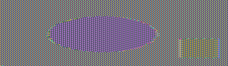

# Crypto II Writeup

Name: Christopher Lai
Section: 0101

I pledge on my honor that I have not given or received any unauthorized
assistance on this assignment or examination.

Digital acknowledgement: Christopher Lai

## Assignment Writeup

### Part 1 (70 Pts)

I ran ```gpg --import key.asc``` to import the secret key, and then ran ```gpg --decrypt message.txt.gpg``` to use the secret key to decrypt this message.

```your flag is: CMSC389R-{m3ss@g3_!n_A_b0ttl3}```


Afterwards, I ran the command ```gpg --clearsign signature.txt``` to make a cleartext signature.


### Part 2 (30 Pts)

##### Original


##### ECB


##### CBC


The image encrypted using ecb mode still has the shapes roughly visible, while the image encrypted using cbc is just a bunch of colorful digital noise.

Ecb is a relatively basic form of block cipher encryption, while cbc uses previous blocks to encrypt the current block, making it more secure.


